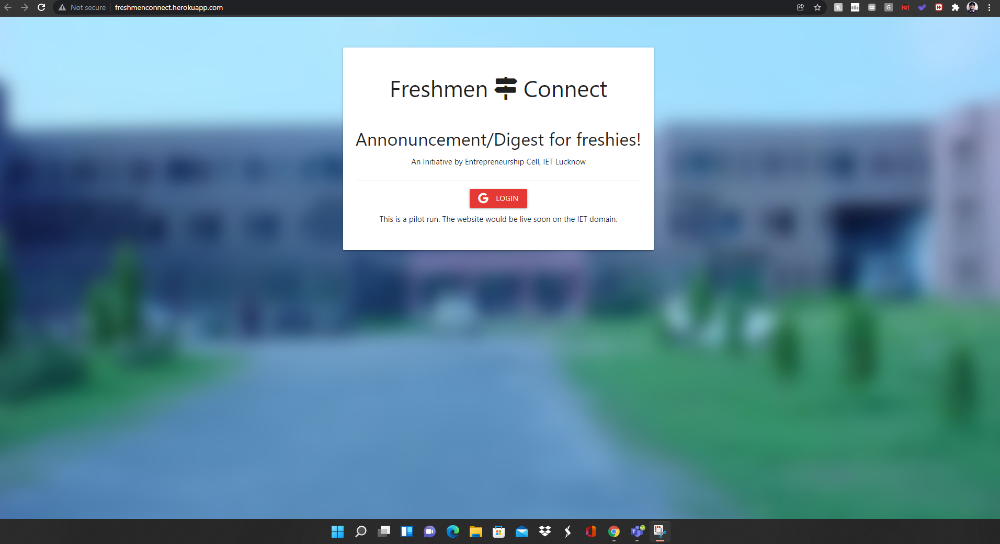
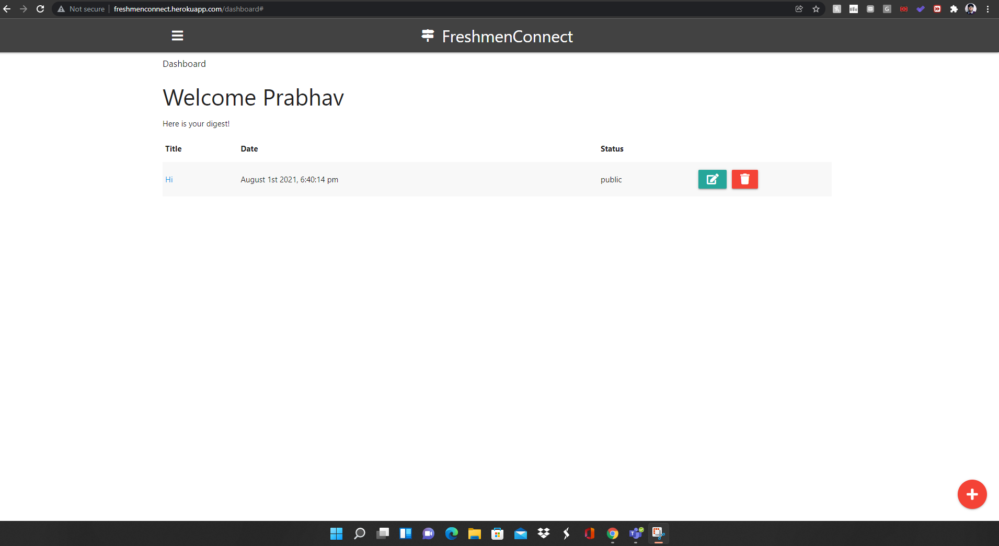
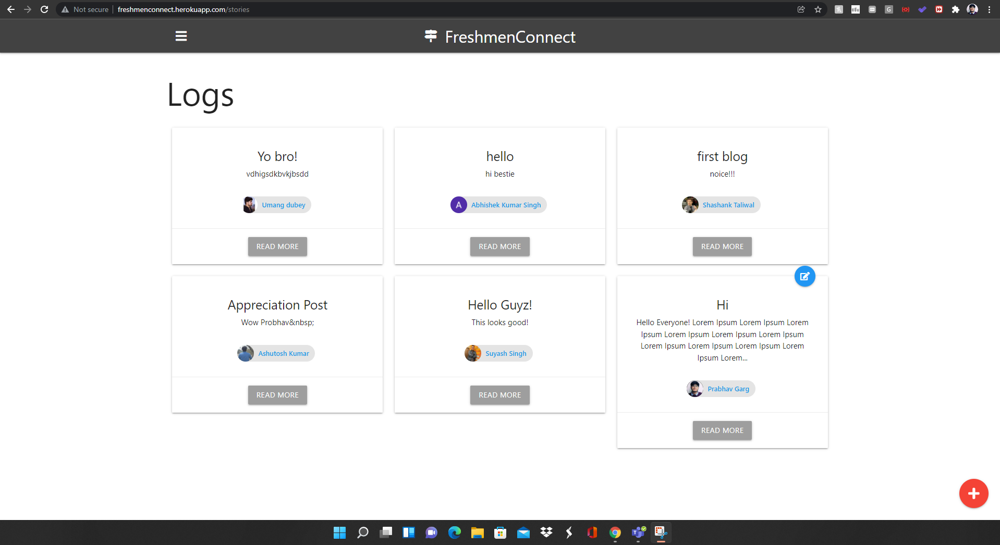
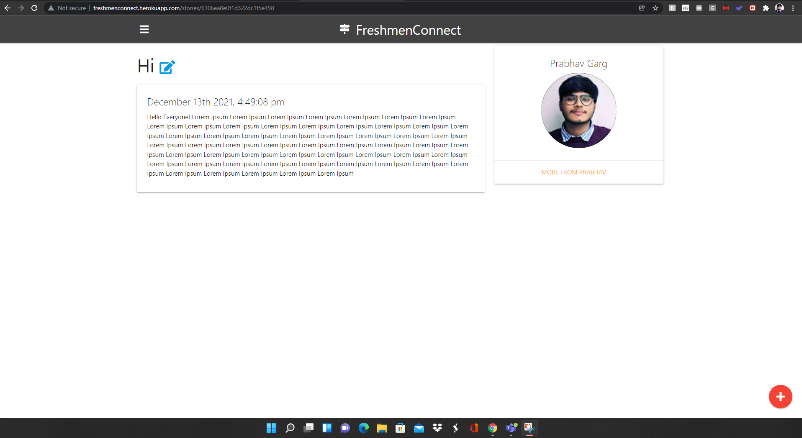
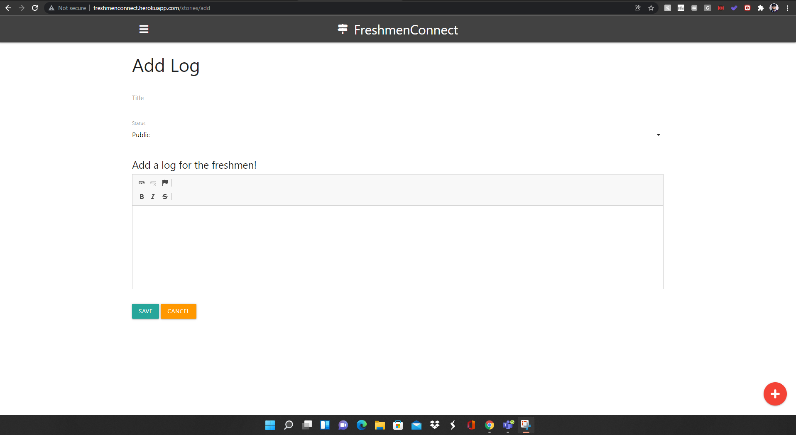

# FreshmenConnect<r> 

Deployed on Heroku: http://freshmenconnect.herokuapp.com/

  
Delivered this end-to-end project to the Entrepreneurship-cell of the institute.  
• An Announcement/feed sharing portal made to bride the gap between 500+  
freshmen enrolled in the year(2020) ensuring their smooth on-boarding and coordination with other batches.
• Integrated MongoDB Database and Authentication  
• Tech-stack: NodeJS | ExpressJS | MongoDB | Handlebars | GoogleOAuth  
